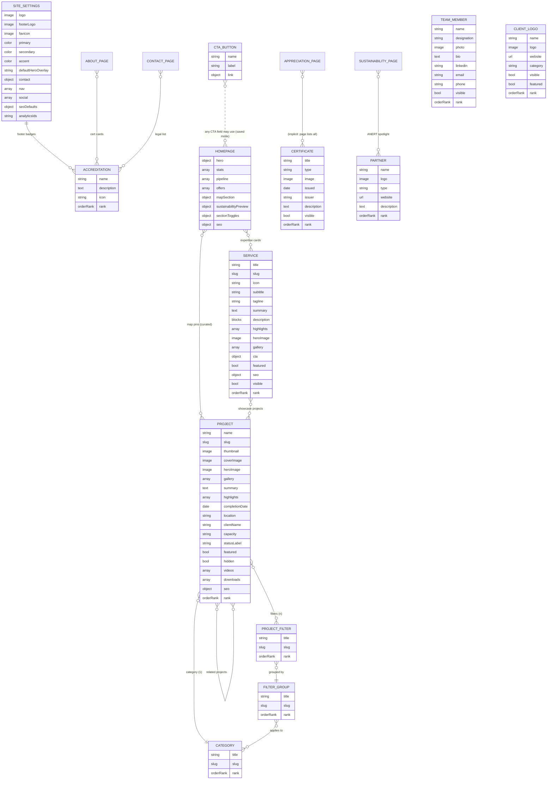

# Ras Al Assad — Sanity CMS Implementation Plan

> **For agentic workers:** REQUIRED SUB-SKILL: Use superpowers:subagent-driven-development (recommended) or superpowers:executing-plans to implement this plan phase-by-phase. Phases use checkbox (`- [ ]`) syntax for tracking. This document is the **architecture plan** (Phase 2 kickoff deliverable); before executing each phase, expand it into bite-sized TDD tasks per `superpowers:writing-plans`.

**Goal:** Give the (non-technical) Ras Al Assad client a Sanity Studio "admin panel" from which they can manage every page, project, service, image, and setting of the website without developer help — while preparing the codebase for a future Supabase backend (client portal, leads, auth).

**Architecture:** Sanity Studio embedded in the existing Next.js 15 app at `/studio` (single repo, single Vercel deploy). All hardcoded content arrays are lifted into ~10 singleton documents + 10 collections; existing client components are kept pixel-identical and fed data via props from new server-component pages. Sanity's CDN serves optimized images; GROQ + TypeGen give end-to-end type safety.

**Tech Stack:** Next.js 16 (App Router) · React 19 · Sanity v6 (Studio + Content Lake, StarlingAds account) · `next-sanity` (Live Content API, Visual Editing) · `@sanity/image-url` · `sanity-plugin-media` · `@sanity/orderable-document-list` · `@sanity/color-input` · TypeScript (strict) · Tailwind. Future (out of scope now, designed-for): Supabase (DB + Auth), SMTP.

**Revisions:** v1 2026-07-15 (initial) · v2 2026-07-15 — review feedback incorporated (see Appendix B) · v3 2026-07-15 — development principles promoted to binding constraints · **v4 2026-07-15 — dependency stack corrected against reality during Phase 0.** v1/v2 assumed "Sanity v4 + React 18" from stale knowledge; v3 corrected that to "Sanity 5 + Next 15", which then **failed at build time**. The verified, implemented matrix is Next 16 + React 19 + Sanity 6 — see Part 0 for the proof and the reasoning, which is the single most important thing to read before touching dependencies.

---

## Development Principles (binding — apply to every phase and all future work)

### Principle 1 — Never hardcode business content

Every piece of editable content **must originate from Sanity**: text, images, buttons, colors, navigation, metadata, statistics, categories, filters, project details, partner information, contact information, and any future marketing section.

The frontend contains **only** layout, styling, animations, and business logic. No exceptions for "it's just one string" or "it'll never change" — those are the exact assumptions that produced the 42-project hardcoded array this project is now migrating away from.

**Permitted in code (not business content):** design tokens the client does not manage, animation timings, calculation algorithms, route paths, ARIA labels, and developer-facing error strings.

### Principle 2 — CMS First Development

Before creating any new UI component, page, or feature: **determine whether the content should be editable by the client. If yes, model it in Sanity first, then build the frontend against the generated schema types.** Never retrofit the CMS afterward.

The order is always: *schema → seed/sample content → GROQ query → TypeGen → component*. A component built against hardcoded data "for now" is technical debt created on purpose, and retrofitting it costs more than modelling it correctly the first time.

**Applies to future features too.** Any feature added after this plan completes is checked against Principle 1 before a line of JSX is written.

---

## Global Constraints

- Client is **not technical** — every field gets a human title + one-line description; no field named `slug`, `oem`, `og` etc. without a plain-English label; technical fields hidden where possible.
- **No hardcoded taxonomies** — categories, filters, and filter groups are documents the client creates.
- Existing visual design must not change during migration — components keep their markup; only their data source changes.
- All current URLs keep working (`/services#solar-epc` anchors, `/projects`, etc.).
- CMS architecture must not conflict with future Supabase features (client login, project dashboard, leads, notifications). **No lead/PII data is stored in Sanity** (Content Lake published data is publicly readable).
- Sanity project lives under the **StarlingAds** account; dataset `production`.
- Let Sanity generate `_id`s for ordinary documents; fixed IDs only for singletons (`siteSettings`, `homePage`, …).
- Images: every image field uses `hotspot: true` + alt text; editors never see raw asset IDs.
- **Dependency stack is fixed by §0** — do not upgrade Sanity/React/Next majors mid-plan without redoing the §0 compatibility check.

---

## Part 0 — Dependency Stack (verified by build 2026-07-15 — authoritative)

> **Read this before changing any dependency.** Two earlier revisions of this plan got the stack wrong, and the reason is subtle enough to catch anyone.

### The rule that governs everything: Next.js vendors its own React

Next.js does **not** use the `react` in `node_modules` for App Router code. It aliases `react`/`react-dom` to a copy it bundles itself (`next/dist/compiled/react`, see `next/dist/build/webpack-config.js:653`). **The React version that matters is the one Next vendors, not the one npm installed.** Peer-dependency ranges cannot express this, so npm will happily install a combination that cannot build.

That is exactly what happened here:

| | vendored React | exports `useEffectEvent`? |
|---|---|---|
| `next@15.5.20` | `19.2.0-canary-0bdb9206-20250818` | ❌ no |
| `next@16.2.10` | `19.3.0-canary-3f0b9e61-20260317` | ✅ yes |

`sanity@5`/`sanity@6` import `useEffectEvent` (a React 19.2 API) — hence their `react@^19.2.2` peer. So **Sanity 5 and 6 cannot run on Next 15**, despite `next-sanity@11` permitting `next@^15 || ^16` alongside `sanity@^4.22 || ^5`. That range means "pick a compatible corner", not "any combination works":

- ✅ Next 15 + Sanity 4 · ✅ Next 16 + Sanity 5/6 · ❌ **Next 15 + Sanity 5** (installs cleanly, fails to build)

The peer ranges tell the story: `sanity@4` peers `react@^18 || ^19`, so it *cannot* use a 19.2-only API; `sanity@5`/`6` peer `react@^19.2.2` precisely *because* they do.

Sanity 4 was ruled out separately: its last release was **2025-12-16 — the same day Sanity 5 shipped** — i.e. abandoned at v5's launch, two majors behind. Sanity ships a major roughly every 5–6 months (4.0 Jul-2025 → 5.0 Dec-2025 → 6.0 Jun-2026). Starting a multi-year foundation there contradicts "avoid technical debt", and escaping it later costs the Next 16 migration anyway.

**Next 16 was therefore the only path to a maintained CMS**, and it is mature: released 2025-10-22 (~9 months before this plan), 31 stable releases through 16.2.10.

### Implemented matrix (installed and build-verified)

| Package | Version | Why |
|---|---|---|
| `next` | `16.2.10` | Only line whose vendored React exposes `useEffectEvent`, which Sanity 6 requires. |
| `react` / `react-dom` | `19.2.7` | `sanity@6` peers `react@^19.2.2`. |
| `sanity` | `6.5.0` | Current line. |
| `next-sanity` | `13.1.3` | Peers `next@^16`, `react@^19.2.3`, `sanity@^5.29 \|\| ^6`. |
| `@sanity/vision` | `6.5.0` | Must match the `sanity` major (`sanity@^6.0.0-0`). |
| `sanity-plugin-media` | `6.0.1` | Media library. |
| `@sanity/orderable-document-list` | `2.0.12` | Drag-to-reorder lists. |
| `@sanity/color-input` | `6.0.14` | Branding colour swatches. |
| `@sanity/image-url` | `2.1.1` | No React peer. |
| `@sanity/client` | `7.23.1` | Peer of `next-sanity`; installed transitively. |
| `styled-components` | `6.4.3` | Direct peer of `sanity` — must be an explicit dependency. |
| `framer-motion` | `12.42.2` | v11 peers `react@^18` only, blocking React 19. v12 peers `^18 \|\| ^19`. |
| `eslint` / `eslint-config-next` | `9.x` / `16.2.10` | Next 16 removed `next lint`; ESLint 9 flat config is required. |
| `@types/react` / `@types/react-dom` | `^19` | Match the React runtime. |

**Node:** `>=22.12` (`sanity@6`'s floor — the highest of any package here). Set this on Vercel too.

### Consequences (all handled in Phase 0)

1. **React 18 → 19 and Next 15 → 16 are dependency upgrades, not design changes.** Verified by diffing the built SSR output against the live production site: 13/13 content fragments identical.
2. **`src/types/swiper.d.ts` rewritten.** It augmented the **global** `JSX` namespace, which React 19's types removed. `<swiper-container>`/`<swiper-slide>` are used by `ExpertiseSlider` and `ProjectsSlider`, so it is load-bearing; it now augments `declare module 'react' { namespace JSX { … } }`.
3. **framer-motion v12 tightened `Easing`.** `BezierDefinition` is `readonly [number, number, number, number]`, so bezier arrays stored in variables need `as const` (inline ones are contextually typed and fine).
4. **`Studio` needs an explicit client boundary.** `sanity-plugin-media` imports `useForm` from `react-hook-form`, whose `react-server` export condition deliberately omits hooks. Importing `sanity.config` from a Server Component therefore fails to build — see `src/app/(studio)/studio/[[...tool]]/Studio.tsx`.
5. **ESLint migrated to flat config** (`eslint.config.mjs`), since Next 16 removed `next lint`.

### If a future upgrade is considered

Re-run this check first: confirm the target Next version's **vendored** React satisfies Sanity's `react` peer —
`node -e "console.log(/useEffectEvent/.test(require('fs').readFileSync('node_modules/next/dist/compiled/react/cjs/react.development.js','utf8')))"`
A green `npm install` is **not** evidence of compatibility.

---

## Part 1 — Current-State Analysis (what the CMS must absorb)

### 1.1 Route & component inventory

| Route | Server page | Client component (kept as-is) | Hardcoded content found |
|---|---|---|---|
| `/` | `src/app/page.tsx` | 10 section components | Hero copy, 5 rotating words, 5 floating images, CTAs |
| `/about` | re-exports `en/about/AboutClient` | `AboutClient.tsx` (294L) | Mission, Vision, story, principles, DEWA/ESCO cards, ANERT section |
| `/services` | re-exports | `ServicesClient.tsx` (323L) | `services[]` — 6 services (anchor ids: `solar-epc, mep, hvac, substations, om, wind-energy`), Zero-Capital Solar section |
| `/projects` | re-exports | `ProjectsClient.tsx` (1086L) | `projects[]` — **42 projects**; `categories[]` (solar/wind/infrastructure); hardcoded sub-filters: OEM brands `["LONGi","Jinko","Trina","Canadian Solar","JA Solar"]` and sectors `["government","industrial","commercial","utility"]`; detail shown in a modal (no detail pages) |
| `/sustainability` | re-exports | `SustainabilityClient.tsx` (650L) | Commitment points, impact stats, Wind Energy, Green Hydrogen, UAE Energy Strategy 2050, ANERT |
| `/appreciation` | re-exports | `AppreciationClient.tsx` (458L) | `certificates[]` (3), `accreditations[]` (5) |
| `/team` | re-exports | `TeamClient.tsx` (207L) | `teamMembers[]` (4): name, role, image, bio, stats, accreditation |
| `/contact` | re-exports | `ContactClient.tsx` (300L) | Address (PO Box 241029, Saraya Avenue, Al Garhoud), phones, emails (`info@`, `solar@rasalassad.ae`), hours, legal accreditations, inquiry form (front-end only) |
| `/solar-calculator` | re-exports | `SolarCalculatorClient.tsx` (488L) | Calculation constants, lead-gate contact modal (front-end only) |
| `/login` | re-exports | `LoginClient.tsx` (164L) | Placeholder client-portal login (no auth logic) — future Supabase |

Homepage sections (in order): `Hero` → `ExpertiseSlider` (4 cards) → `ClientLogos` (23 numbered PNGs `Asset 3..25.png`) → `StatsSection` (4 credentials + 5 EPC pipeline steps) → `InteractiveMap` (6 pins with x/y % coords on UAE SVG) → `HighlighterServices` (5 offers — **uses Unsplash hotlinks**) → `ProjectsSlider` (6 duplicated project entries) → `SustainabilityPreview` (4 features) → `AnertPartner` → `LatestNews` (6 institutions: DEWA, Etihad ESCO, …).

`Navbar` (services dropdown hardcoded) and `Footer` (capability/company/certification link lists, contact info, copyright) are also hardcoded.

### 1.2 Problems the CMS phase must fix (found during analysis)

1. **Zero per-page SEO.** Only `src/app/layout.tsx` exports metadata; every page is a `"use client"` re-export with no `generateMetadata`. The CMS refactor converts each page to a server component — per-page SEO becomes possible for the first time.
2. **Duplicate route tree.** `/en/*` and `/*` both render (root pages re-export the `/en` clients, but `/en/about` etc. are still directly reachable) → duplicate-content SEO risk. Fix with 301 redirects `/en/:path → /:path` (the `/en` folder is kept only as the code location, or components move to `src/components/pages/`).
3. **Images unoptimized.** `next.config.mjs` sets `images.unoptimized: true`; `/public/assets/Projects` is 13.1 MB of JPEGs; filenames contain double spaces. Sanity CDN + `next/image` fixes this wholesale.
4. **Unsplash hotlinks** in `HighlighterServices` — must become owned, uploaded assets.
5. **Duplicated project data** — `ProjectsSlider`, `InteractiveMap`, and `ProjectsClient` each carry their own copies of project info. Single `project` document becomes the source of truth.
6. **Data quality to resolve during seeding:** placeholder `email@company.ae` and `+971 50 123 4567` in `ContactClient`; project years include "2026"; one project image reused across pages.

### 1.3 Requirement → model mapping (terminology decisions)

The requirements name several overlapping concepts. This plan maps them as:

| Requirement term | Modeled as |
|---|---|
| Project Category | `category` document (Solar, Wind, Infrastructure, Electromechanical, EPC, …) — primary, one per project |
| Project Filters | `projectFilter` documents grouped by `filterGroup` documents |
| OEM | a `projectFilter` inside the seeded "Panel Brand (OEM)" filter group |
| Project Type (Commercial/Government/…) | a `projectFilter` inside the seeded "Sector" filter group |
| Project Status | plain text label on the project (marketing copy like "Completed & Under AMC"); *operational* status for the client portal comes later in Supabase |
| Appreciation | `certificate` documents (type: Certificate / Award / Recognition) |
| Certifications / legal accreditations | `accreditation` documents (DEWA Shams, Etihad ESCO, ISO 9001, DM license…) — reused on About, Appreciation, Contact, Footer |
| Partners / Supporting partners / "institutions" | `partner` documents with a Type field (Supporting Partner = ANERT; Authority = DEWA, Etihad ESCO, …) |

---

## Part 2 — CMS Architecture Overview

### 2.1 Topology

```
┌────────────────────────────── Vercel (one deploy) ─────────────────────────────┐
│  Next.js 15 App Router                                                         │
│  ├─ /            public site — server components, sanityFetch (live/ISR)      │
│  ├─ /studio/[[...tool]]   Sanity Studio v4 (client admin panel)                │
│  ├─ /api/draft-mode/enable    presentation-tool preview entry                  │
│  └─ sitemap.ts / robots.ts    generated from Content Lake                      │
└──────────────┬─────────────────────────────────────────────────────────────────┘
               │ GROQ over HTTPS (CDN-cached) + Live Content API
┌──────────────▼───────────────┐        ┌──────────────────────────────┐
│  Sanity Content Lake         │        │  Sanity Image CDN            │
│  StarlingAds acct · dataset  │        │  (auto WebP/AVIF, resize,    │
│  `production`                │        │   crops from hotspot)        │
└──────────────────────────────┘        └──────────────────────────────┘

Future (Phase 3, designed-for, NOT built now):
  Supabase (leads, client accounts, per-client project status) ←→ Next.js API routes
  SMTP relay for inquiry notifications
```

**Why embedded Studio (vs separate repo):** one deploy, one URL for the client (`www.rasalassad.ae/studio`), shared TypeGen types, and Presentation tool preview works with zero CORS friction. A standalone studio can be split out later without schema changes if ever needed.

**Environment variables** (added to `.env.local` + Vercel):

```
NEXT_PUBLIC_SANITY_PROJECT_ID=  # from StarlingAds account
NEXT_PUBLIC_SANITY_DATASET=production
NEXT_PUBLIC_SANITY_API_VERSION=2026-07-01
SANITY_API_READ_TOKEN=          # Viewer token — draft preview / live content
```

### 2.2 The three content layers

1. **Site Settings (1 singleton)** — brand, navigation, footer, contact details, social links, SEO defaults, analytics. Contact details live **only here** (footer + contact page + JSON-LD all read the same object — the client updates a phone number once).
2. **Pages (9 singletons)** — one document per fixed page. Each owns its hero copy, its sections, and its SEO. Section text lives on the page document; anything *listed* on a page (projects, team, logos, certificates…) comes from collections.
3. **Collections (10 document types)** — repeatable business content: services, projects, categories, filter groups, filters, team, certificates, accreditations, partners, client logos.

---

## Part 3 — Content Model Diagram



**Relationship rules**

- `project → category` : required, single reference (drives the primary filter bar).
- `project → projectFilter[]` : optional, multi. The frontend renders one sub-filter row per `filterGroup` whose `appliesTo` includes the active category — exactly reproducing today's behavior (Solar → brand row; Infrastructure → sector row) with zero hardcoding.
- `project → project[]` (related): manual pick, capped at 4; frontend falls back to "same category, latest" when empty.
- References are **deletion-protected by Sanity automatically** — the client cannot delete a category still used by projects (Studio explains why), so no orphan states.
- Nothing on a page document duplicates collection data — pages hold copy; collections hold things.

---

## Part 4 — Sanity Schema Plan

Directory layout (new files):

```
src/sanity/
├── env.ts                    # projectId / dataset / apiVersion exports
├── lib/
│   ├── client.ts             # createClient (next-sanity)
│   ├── live.ts               # defineLive → sanityFetch + SanityLive
│   ├── image.ts              # urlFor() builder
│   └── queries.ts            # all defineQuery GROQ (per page)
├── schemaTypes/
│   ├── index.ts              # export const schemaTypes = [...]
│   ├── objects/
│   │   ├── seo.ts            # shared SEO object
│   │   ├── figure.ts         # image + alt + caption (hotspot)
│   │   ├── link.ts           # smart link (page route | service | external | anchor)
│   │   ├── cta.ts            # button: saved (reusable ctaButton) OR custom label + link
│   │   ├── pageHero.ts       # shared internal-page hero (title/subtitle/bg/overlay/CTA)
│   │   ├── navItem.ts        # menu item (label/link/enabled/dropdown)
│   │   ├── stat.ts           # prefix + value + suffix + label + icon
│   │   └── iconPicker.ts     # curated lucide icon name list (visual select)
│   ├── singletons/
│   │   ├── siteSettings.ts
│   │   ├── homePage.ts
│   │   ├── aboutPage.ts
│   │   ├── servicesPage.ts
│   │   ├── projectsPage.ts
│   │   ├── sustainabilityPage.ts
│   │   ├── appreciationPage.ts
│   │   ├── teamPage.ts
│   │   ├── contactPage.ts
│   │   └── solarCalculatorPage.ts
│   └── documents/
│       ├── service.ts
│       ├── project.ts
│       ├── category.ts
│       ├── filterGroup.ts
│       ├── projectFilter.ts
│       ├── teamMember.ts
│       ├── certificate.ts
│       ├── accreditation.ts
│       ├── partner.ts
│       ├── clientLogo.ts
│       └── ctaButton.ts      # reusable buttons ("Get a Quote", "Request Consultation", …)
├── structure/index.ts        # client-friendly desk structure
└── presentation/resolve.ts   # document → URL locations
sanity.config.ts              # root config (structureTool, presentationTool, media, vision)
sanity.cli.ts
```

### 4.1 Shared objects (exact field specs)

**`seo` object** — attached to every page singleton, service, and project. Rendered as a collapsed group so editors are never overwhelmed:

```ts
// src/sanity/schemaTypes/objects/seo.ts
import {defineField, defineType} from 'sanity'

export const seo = defineType({
  name: 'seo',
  title: 'Search Engine Settings (SEO)',
  type: 'object',
  options: {collapsible: true, collapsed: true},
  fields: [
    defineField({
      name: 'title', type: 'string', title: 'Search Result Title',
      description: 'Shown as the blue link on Google. Leave empty to use the page/item name. Best under 60 characters.',
      validation: (r) => r.max(70).warning('Google cuts titles off after ~60 characters'),
    }),
    defineField({
      name: 'description', type: 'text', rows: 3, title: 'Search Result Description',
      description: 'The grey text under the title on Google. Best 120–160 characters.',
      validation: (r) => r.max(170).warning('Google cuts descriptions off after ~160 characters'),
    }),
    defineField({
      name: 'ogImage', type: 'image', title: 'Social Share Image',
      description: 'Shown when this page is shared on WhatsApp / LinkedIn / X. Ideal size 1200×630. Leave empty to use the site default.',
      options: {hotspot: true},
    }),
    defineField({
      name: 'keywords', type: 'array', of: [{type: 'string'}], title: 'Focus Keywords',
      description: 'Optional. A few phrases this page should rank for.',
      options: {layout: 'tags'},
    }),
    defineField({
      name: 'canonicalUrl', type: 'url', title: 'Canonical URL (advanced)',
      description: 'Only fill this if this page duplicates content that lives at another address. Usually leave empty.',
    }),
    defineField({
      name: 'noIndex', type: 'boolean', title: 'Hide from search engines', initialValue: false,
      description: 'Turn on to ask Google not to list this page.',
    }),
  ],
})
```

**`figure` object** (used for every content image):

| Field | Type | Notes |
|---|---|---|
| `image` | `image` (`hotspot: true`) | the asset itself |
| `alt` | `string` | "Describe this image for Google & screen readers" — `warning()`-level required |
| `caption` | `string` | optional, shown in galleries/lightboxes |

**`link` object** (what non-technical editors see instead of raw URLs) — one field `linkType` (radio: *Page on this website* / *A service* / *A project* / *External website* / *Email* / *Phone*), then conditionally (via `hidden` callbacks) exactly one of: `page` (dropdown of fixed routes: Home, About, Services, Projects, Sustainability, Appreciation, Team, Contact, Solar Calculator), `service` (reference), `project` (reference), `url`, `email`, `phone`, plus optional `anchor`. The frontend resolves it to an href.

**`cta` object** (button) — dual mode so buttons can be managed globally *or* one-off:

| Field | Type | Behavior |
|---|---|---|
| `mode` | radio: *Use a saved button* / *Custom button* | initial: Custom |
| `savedButton` | reference → `ctaButton` | shown only in saved mode — "edit the saved button once, it updates everywhere it's used" |
| `label` | string | custom mode |
| `link` | `link` | custom mode |

**`stat` object** (used for homepage credentials, sustainability impact numbers, and any future counters):

| Field | Type | Example |
|---|---|---|
| `prefix` | string, optional | "AED", "+" |
| `value` | string, required | "13", "50", "2.4" |
| `suffix` | string, optional | "+", "MWp", "%" |
| `label` | string, required | "Years Experience" |
| `description` | string, optional | "in Renewable Energy" — small line under the label |
| `icon` | `iconPicker`, optional | shown beside the number where the design uses one |

**`pageHero` object** — one shared hero pattern for **every internal page** (About, Services, Projects, Sustainability, Appreciation, Team, Contact, Solar Calculator). Matches the current "premium black overlay" internal-hero design and gives the client one consistent editing experience:

| Field | Type | Behavior |
|---|---|---|
| `title` | string, required | the H1 |
| `subtitle` | text (rows 2), optional | supporting line under the title |
| `backgroundImage` | `figure`, optional | "Recommended 1920×900 or larger"; page falls back to its default art when empty |
| `overlay` | radio: *Site default* / *Dark* / *Light* | initial *Site default* → resolves to Site Settings → Branding → Default Hero Overlay |
| `cta` | `cta`, optional | hero button (e.g. "Get a Quote") |

(The **homepage hero stays its own richer schema** — rotating words, floating images, dual CTAs — because its design is unique; `pageHero` covers all internal pages.)

**`navItem` object** — the fully CMS-driven menu entry (used by Site Settings → Navigation for both header and footer menus):

| Field | Type | Behavior |
|---|---|---|
| `label` | string, required | menu text |
| `link` | `link` | internal page / service / project / **external URL** — all supported by the link object |
| `enabled` | boolean, initial true | switch an item off without deleting it (badge shows ⏸ Disabled) |
| `dropdown` | boolean, initial false | "Show a dropdown of all visible services under this item" — auto-populated in service drag-order, zero maintenance |

Menu items live in an array → **drag to reorder** natively.

**`iconPicker`** = string field with `options.list` of the ~18 lucide icon names already used on the site (Sun, Wind, Settings, Zap, Droplets, Leaf, Shield, Award, Calendar, Wrench, Building2, Globe, Factory, PlugZap, Gauge, HardHat, Recycle, BadgeCheck) rendered with a custom input showing the actual icons (enhancement; plain dropdown in v1). Keeps parity with the current lucide-based design without asking the client to upload SVGs.

### 4.2 Collections (documents) — field dictionaries

Every collection gets: drag-and-drop ordering (`orderRank`, hidden field via `@sanity/orderable-document-list`), a friendly `preview` (thumbnail + subtitle), and — where noted — `visible`/`featured` toggles surfaced as list badges.

#### `project` (⭐ highest priority — full spec)

Field groups (tabs): **Basics · Story · Media · Classification · Extras · SEO**

| # | Field | Type | Client-facing title / behavior |
|---|---|---|---|
| 1 | `name` | string, required | "Project Name" |
| 2 | `slug` | slug (source `name`), required | "Web Address" — auto-generated, "Generate" button; description explains it only matters for links/SEO |
| 3 | `thumbnail` | `figure`, required | "Thumbnail — the card image on the Projects grid and sliders" (recommended ≥1200px wide) |
| 3a | `coverImage` | `figure`, optional | "Cover Image (optional) — the wide image in the project spotlight; leave empty to reuse the Thumbnail" |
| 3b | `heroImage` | `figure`, optional | "Hero Image (optional) — reserved for the future project detail page header; falls back to Cover → Thumbnail" |
| 4 | `gallery` | array of `figure` | "Photo Gallery" — drag to reorder; first items shown in the detail view |

> **Image fallback chain (client only *must* provide one image):** `heroImage → coverImage → thumbnail`. The Media tab shows all four slots together so the workflow reads: *Thumbnail (required) · Cover (optional) · Hero (optional) · Gallery*. This keeps day-one effort minimal while making the schema fully detail-page-ready.

| 5 | `summary` | text (rows 3), required, max 220 | "One-Paragraph Summary — shown on cards and Google" |
| 6 | `highlights` | array of string (max 6) | "Key Achievements — bullet points in the project spotlight" (matches current modal UI) |
| 7 | `description` | Portable Text (basic marks + images) | "Full Description (optional)" — for the future detail page; hidden behind the Story tab |
| 8 | `completionDate` | date (`dateFormat: 'MMMM YYYY'`) | "Completion Date" — frontend displays the year like today |
| 9 | `location` | string | "Location" e.g. "Sobha Hartland, Dubai, UAE" |
| 10 | `clientName` | string | "Client / Developer" |
| 11 | `capacity` | string | "Capacity / Scope" e.g. "376.2 kWp Rooftop Solar PV" |
| 12 | `category` | reference → `category`, required | "Category" — drives the main filter bar |
| 13 | `filters` | array of reference → `projectFilter` | "Filters (brand, sector, …)" — powers the sub-filter rows |
| 14 | `statusLabel` | string, initial "Completed & Operational" | "Status Badge" — free text with examples in description ("Completed & Commissioned", "Under Commissioning"…) |
| 15 | `featured` | boolean, initial false | "⭐ Feature on Homepage" — homepage slider pulls `featured == true` |
| 16 | `hidden` | boolean, initial false | "Hide from website" — kept in the CMS, removed from all lists/sitemap |
| 17 | `relatedProjects` | array of reference → `project`, max 4 | "Related Projects (optional)" — auto-fallback: same category, most recent |
| 18 | `videos` | array of object `{title, url}` | "Videos (optional)" — YouTube/Vimeo links |
| 19 | `downloads` | array of object `{title, file}` | "Downloads & Documents (optional)" — datasheets, brochures, PDFs (covers both the *Downloads* and *Documents* requirements). Description warns: files are public |
| 20 | `seo` | `seo` | SEO tab |
| 21 | `orderRank` | string, hidden | drag ordering |

*Client actions coverage:* Add/Edit/Delete = standard Studio · Hide = #16 · Feature = #15 · **Duplicate = built-in "Duplicate" document action** (kept enabled) · Reorder = orderable list · list shows badges for ⭐Featured / 🚫Hidden.

#### `service`

| Field | Type | Notes |
|---|---|---|
| `title` | string, required | "Service Name" |
| `slug` | slug, required | seeded to match current anchors: `solar-epc`, `mep`, `hvac`, `substations`, `om`, `wind-energy` → `/services#<slug>` keeps working; also future-proofs `/services/<slug>` detail pages. **Wind Energy is just a service document** — no special casing |
| `icon` | `iconPicker` | shown in nav dropdown, cards, section headers |
| `subtitle` | string | e.g. "Turnkey Solar Engineering & Construction" |
| `tagline` | string | short badge line, e.g. "DEWA Shams certified grid-tied setups" |
| `summary` | text (rows 2), max 200 | "Short Description — shown on homepage cards and previews" (seeded from the current ExpertiseSlider copy) |
| `featured` | boolean, initial false | "⭐ Feature on Homepage" — the homepage Expertise section auto-pulls featured services |
| `description` | Portable Text | current paragraph content |
| `highlights` | array of string (max 6) | bullet list |
| `heroImage` | `figure`, required | section/detail image |
| `gallery` | array of `figure` | optional |
| `cta` | `cta` | default seeded: "Request Consultation" → Contact page |
| `showcaseProjects` | array of reference → `project` | optional "see it in action" |
| `visible` | boolean, initial true | hide without deleting |
| `seo` | `seo` | for the future detail page |
| `orderRank` | hidden | drag ordering — **also reorders the navbar dropdown and services page sections** |

#### Taxonomy: `category`, `filterGroup`, `projectFilter`

- `category`: `title`, `slug`, `orderRank`. Seeded: Solar, Wind, Infrastructure (+ client adds Electromechanical, EPC, … themselves). The "All Projects" tab is frontend furniture, not a document.
- `filterGroup`: `title` (e.g. "Panel Brand (OEM)", "Sector"), `slug`, `appliesTo` (array of reference → `category` — controls under which main tab this row of filter chips appears; empty = all), `orderRank`.
- `projectFilter`: `title` (e.g. "LONGi", "Government"), `slug`, `group` (reference → `filterGroup`, required), `orderRank`. Seeded: LONGi, Jinko, Trina, Canadian Solar, JA Solar → *Panel Brand*; Commercial, Government, Industrial, Utility → *Sector*.
- Structure shows filters **nested under their group** so the mental model is "groups contain chips". Adding "Mounting Type → Carport/Rooftop/Ground" someday = 4 documents, zero code.

#### `teamMember`

`name`* · `designation`* ("Job Title") · `photo` (`figure`)* · `bio` (text) · `stats` (string, "e.g. 15+ Years UAE Leadership") · `accreditation` (string, "badge line under the name") · `linkedin` (url) · `email` (email regex validation) · `phone` (string) · `visible` (boolean, true) · `orderRank`.

#### `certificate` (Appreciation)

`title`* · `type` (radio: Certificate / Award / Recognition) · `image` (`figure`)* · `description` (text) · `date` (date, month display) · `issuer` (string, "Issued by") · `visible` · `orderRank`.

#### `accreditation`

`name`* ("DEWA Shams Dubai") · `shortLabel` (string — footer-length text) · `description` (string — "Registered Solar PV Contractor") · `icon` (`iconPicker`) · `licenseNumber` (string, optional — powers the Contact-page legal lines) · `orderRank`. Consumed by: About cert cards, Appreciation "Accreditations & Affiliations", Contact "Legal Accreditations", Footer badge list.

#### `partner`

`name`* · `logo` (`figure`) · `type` (radio: **Supporting Partner** / **Authority & Regulatory** / **Industry Partner**) · `website` (url) · `description` (text) · `role` (string — e.g. "Certified Solar PV Contractor", used by the institutions grid) · `orderRank`. ANERT ⇒ Supporting Partner (drives `AnertPartner` sections); DEWA, Etihad ESCO, Dubai Municipality… ⇒ Authority (drives `LatestNews` grid).

#### `clientLogo`

`name`* ("Company name — shows as tooltip/alt") · `logo` (image, required — no hotspot, `options.accept: 'image/png, image/svg+xml, image/webp'`) · `website` (url, optional) · `category` (radio: Client / Developer / Government / Consultant — optional) · `visible` (boolean, true) · `featured` (boolean, false — "⭐ show when the homepage is set to 'Featured logos only'") · `orderRank`. Migration names the 23 anonymous `Asset N.png` files as "Client 1..23" for the client to rename at leisure.

#### `ctaButton` (Reusable Buttons)

`name`* (internal label, e.g. "Get a Quote — main") · `label`* (button text) · `link`* (`link`). Any `cta` field on any page can switch to *Use a saved button* and pick one of these — updating the saved button's text or destination updates it **everywhere at once**. Seeded: "Request Consultation → Contact", "Explore Projects → Projects", "Get a Quote → Contact", "Contact Us → Contact". List preview shows label + resolved destination; Sanity's reference protection prevents deleting a button that's still in use.

### 4.3 Singletons — field plans

All singletons use field **groups (tabs)** so no screen shows more than ~8 fields at once, and every singleton ends with an `seo` group.

**`siteSettings`** (tabs: Branding · Navigation · Footer · Contact Details · Social · SEO Defaults · Integrations)
- Branding (centralized even where the frontend doesn't consume it yet): `siteName`, `logo` (header), `footerLogo`, `favicon`, `primaryColor` + `secondaryColor` + `accentColor` (`@sanity/color-input` swatches, seeded from the Tailwind palette: gold `#C5A880`, charcoal `#121212`, sand `#F7F4EF`; description: *"Stored centrally — the site currently uses its built-in theme; wiring these to the live design is a follow-up task"*), `defaultHeroOverlay` (radio: Dark / Light, initial Dark — the fallback every `pageHero` uses when set to *Site default*).
- Navigation: `mainMenu` — array of **`navItem`** (§4.1: label · link incl. external · enabled on/off · dropdown toggle · drag-reorder). `headerCta` (`cta`, optional — e.g. a saved "Get a Quote" button).
- Footer: `footerDescription` (text), `capabilityHeading` + auto service links (no field — derived), `companyMenu` (array of `navItem` — same reorder/enable/external-link powers as the header menu), `showAccreditations` (boolean — pulls accreditation collection), `copyrightText` (string with `{year}` token, description explains it auto-updates).
- Contact Details (**single source of truth**): `address` (object: `line1`, `line2`, `poBox`, `city`, `mapsUrl`), `phones` (array of `{label, number}`), `emails` (array of `{label, email}`), `inquiryEmail` (email — "Where should website inquiries be sent?" — reserved for the Phase-3 form backend), `officeHours` (array of `{days, hours}` e.g. "Mon – Fri" / "8:30 AM – 6:00 PM").
- Social: array of `{platform (select: LinkedIn/Instagram/X/Facebook/YouTube/WhatsApp), url}`.
- SEO Defaults: `siteUrl`, `titleTemplate` (initial `%s | Ras Al Assad Electromechanical Works`), `defaultSeo` (`seo` object — fallback description + OG image).
- Integrations: `ga4Id` ("Google Analytics ID (G-XXXX)"), `gtmId`, `metaPixelId` — strings with "your developer/marketer will give you this" descriptions.

**`homePage`** (tabs: Hero · Sections · Stats & Process · Map · Offers · Sustainability · SEO)
- Hero: `announcement` (string, optional pill above H1), `headlinePrefix` ("We engineer" — the static part), `rotatingWords` (array of string, 2–6, seeded: Solar EPC, MEP Works, HVAC Engineering, Substations, O&M Services), `subheadline` (text), `primaryCta` + `secondaryCta` (`cta`), `heroMedia` — object: `mediaType` (radio: *Floating images* (current design) / *Background image* / *Background video*), conditionally `floatingImages` (array of `figure`, exactly 5 — validation `length(5)` with friendly message), `backgroundImage` (`figure`), `backgroundVideo` (`file`, accept `video/mp4`, description: "Keep under 8 MB; no sound"). This satisfies "Hero background image/video" while defaulting to the current art direction.
- Sections (visibility switches): `showExpertise`, `showClientLogos`, `showStats`, `showMap`, `showOffers`, `showFeaturedProjects`, `showSustainability`, `showPartner`, `showInstitutions` — all boolean, initial true. (Order stays fixed by design — reordering sections would break the page's visual rhythm; noted as a possible future page-builder upgrade.)
- Intro/Who-we-are: `introChip` ("Who We Are"), `introHeading`, `introText`.
- Expertise (**auto + override pattern**): cards auto-pull services with `featured == true` in drag order, rendering each service's title, `summary`, and `heroImage`; `expertiseOverride` (array of reference → service, max 4) replaces the automatic pick when non-empty. Description reads: *"Leave empty to show your ⭐ featured services automatically."*
- Client logos: marquee auto-pulls the collection; `logosMode` (radio: *All visible logos* / *Featured logos only*, initial All) + optional `logosHeading` override.
- Stats & Process: `credentials` — array of `stat` (max 4; prefix/value/suffix/label/description/icon — e.g. value "13", suffix "+", label "Years", description "Engineering Experience", icon Calendar), `pipelineHeading`, `pipelineSteps` (array of `{title, description}` — step numbers auto-render 01–05).
- Map: `mapHeading`, `mapSubheading`, `pins` — array (max 8) of `{project: reference → project, x: number 0–100, y: number 0–100}` with description "x/y position the pin on the UAE map — 0,0 is top-left". (Slider inputs; a visual pin-placer is a listed enhancement.)
- Offers (`HighlighterServices`): `offersHeading`, `offers` — array (max 5) of `{title, description, image: figure}` — replaces Unsplash hotlinks with uploads.
- Featured projects (**auto + override pattern**): slider auto-pulls `featured == true` projects in drag order; `featuredProjectsOverride` (array of reference → project) replaces the automatic pick when non-empty. Default mental model stays: star a project anywhere → it's on the homepage.
- Sustainability preview: `heading`, `text`, `features` (array of `{icon, title, description}` — 4), `cta`.
- Partner spotlight: `partner` (reference → partner), `heading`, `text` (ANERT copy).
- Institutions: `institutionsHeading` — grid auto-pulls partners of type Authority.

**`aboutPage`** (tabs: Hero · Mission & Vision · Our Story · Principles · Partners · SEO): `hero` (`pageHero`), `overview` (text), `mission` (text), `vision` (text), `storyHeading` (seeded "From Mechanical Precision to Solar Excellence"), `storyBody` (Portable Text), `storyImage` (`figure`), `certCards` (array of reference → `accreditation`, max 4 — the DEWA/ESCO cards), `principlesHeading`, `principles` (array of `{icon, title, description}` — 3), `partnerHeading`, `partnerText` (ANERT section copy; logo comes from the partner doc), `gallery` (array of `figure`, optional), `seo`.

**`servicesPage`**: `hero` (`pageHero`), `zeroCapital` object (`heading` "Go Solar with Zero Capital Investment", `text`, `benefits` array of `{title, description}` — 3, `cta`), `seo`. (The service sections themselves come from the `service` collection in drag order.)

**`projectsPage`**: `hero` (`pageHero`), `emptyStateText` ("No projects in this category yet"), `seo`.

**`sustainabilityPage`** (tabs per section): `hero` (`pageHero`), `commitment` (`heading`, `text`, `points` array of `{icon, title, description}` — 4), `impact` (`heading`, `stats` array of `stat` — 4), `windEnergy` (`heading`, `body` Portable Text, `image`, `cta`), `greenHydrogen` (`heading`, `body`, `image`, `bullets` array of string), `uaeStrategy` (`heading`, `body`, `stats` array of `stat`), `partnerSection` (`heading`, `text`, `partner` ref), `pageCta` (`heading`, `text`, `cta`), `seo`.

**`appreciationPage`**: `hero` (`pageHero`, seeded title "A Legacy Built on Excellence"), `certificatesHeading`, `accreditationsHeading`, `moreToCome` (`heading`, `text`), `pageCta` (`heading`, `text`, `cta`), `seo`. Certificates + accreditations render from their collections.

**`teamPage`**: `hero` (`pageHero`), `seo`.

**`contactPage`**: `hero` (`pageHero`, seeded title "Connect With Our Engineers"), `departments` — array of `{name, email, phone, note}` (embedded: page-specific, not reused — e.g. Estimation, Solar Division, O&M Support), `formHeading` ("Request Project Cost Feasibility"), `formSuccessHeading` + `formSuccessText` (current "Engineering Request Logged" copy), `mapEmbed` (object: `lat`, `lng`, or `embedUrl` — "paste a Google Maps link"), `seo`. Address/phones/emails/hours render from **Site Settings → Contact Details** (shown in Studio via a read-only note field pointing there — no duplicate entry).

**`solarCalculatorPage`** (improvement — makes the calculator maintainable): `hero` (`pageHero`), `assumptions` object — numeric fields lifted verbatim from `SolarCalculatorClient.tsx` at implementation time (tariff AED/kWh, cost per kWp, generation kWh/kWp/yr, CO₂ kg/kWh, payback bounds) each with plain-English titles + "changing this changes every estimate" warnings, `leadGateEnabled` (boolean — currently the contact modal), `disclaimer` (text), `seo`.

---

## Part 5 — Dashboard (Studio Structure) Design

### 5.1 Navigation tree (what the client sees)

```
RAS AL ASSAD — CONTENT STUDIO           (custom title + logo + gold theme)
│
├── ⚙️  Site Settings                    (singleton)
├── ─────────── PAGES ───────────
├── 🏠  Homepage                         (singleton)
├── 🏢  About Page                       (singleton)
├── 🌿  Sustainability Page              (singleton)
├── 🏆  Appreciation Page                (singleton)
├── 📞  Contact Page                     (singleton)
├── 🧮  Solar Calculator                 (singleton)
├── ─────────── CONTENT ───────────
├── 🔧  Services
│     ├── 📄 Services Page (intro & Zero-Capital section)   (singleton)
│     └── 🧩 All Services                (orderable list — drag to reorder site + menu)
├── 📁  Projects
│     ├── 📄 Projects Page (intro)      (singleton)
│     ├── 🗂  All Projects               (orderable, badges: ⭐ featured · 🚫 hidden)
│     ├── ⭐  Featured Projects          (filtered list)
│     ├── 🚫  Hidden Projects            (filtered list)
│     └── 📂  By Category → [category] → projects
├── 🏷️  Categories                       (orderable)
├── 🎚️  Project Filters
│     ├── 🗃  Filter Groups              (orderable)
│     └── per-group lists of filter chips (orderable)
├── 👥  Team
│     ├── 📄 Team Page (intro)          (singleton)
│     └── 🧑‍💼 Team Members               (orderable, 👁 hidden badge)
├── 🖼️  Client Logos                     (orderable, grid-friendly previews)
├── 🤝  Partners                         (orderable)
├── 🛡️  Accreditations                   (orderable)
├── 🏅  Certificates & Awards            (orderable)
├── 🔘  Buttons (CTAs)                   (reusable ctaButton documents)
│
└── (top toolbar) 🖼 Media · 👁 Preview (Presentation) · Vision (admin-only)
```

Implementation skeleton (pattern per `studio-structure` best practices — singletons via fixed `documentId`, filtered out of generic lists):

```ts
// src/sanity/structure/index.ts
import type {StructureResolver, StructureBuilder} from 'sanity/structure'
import {orderableDocumentListDeskItem} from '@sanity/orderable-document-list'

const SINGLETONS = ['siteSettings','homePage','aboutPage','servicesPage','projectsPage',
  'sustainabilityPage','appreciationPage','teamPage','contactPage','solarCalculatorPage']

const singleton = (S: StructureBuilder, type: string, title: string, icon?: any) =>
  S.listItem().title(title).icon(icon)
    .child(S.document().schemaType(type).documentId(type).title(title))

export const structure: StructureResolver = (S, context) =>
  S.list().title('Ras Al Assad — Content').items([
    singleton(S, 'siteSettings', 'Site Settings'),
    S.divider(),
    singleton(S, 'homePage', 'Homepage'),
    singleton(S, 'aboutPage', 'About Page'),
    singleton(S, 'sustainabilityPage', 'Sustainability Page'),
    singleton(S, 'appreciationPage', 'Appreciation Page'),
    singleton(S, 'contactPage', 'Contact Page'),
    singleton(S, 'solarCalculatorPage', 'Solar Calculator'),
    S.divider(),
    S.listItem().title('Services').child(S.list().title('Services').items([
      singleton(S, 'servicesPage', 'Services Page (intro)'),
      orderableDocumentListDeskItem({type: 'service', title: 'All Services', S, context}),
    ])),
    S.listItem().title('Projects').child(S.list().title('Projects').items([
      singleton(S, 'projectsPage', 'Projects Page (intro)'),
      orderableDocumentListDeskItem({type: 'project', title: 'All Projects', S, context}),
      S.listItem().title('⭐ Featured').child(
        S.documentList().title('Featured Projects').filter('_type == "project" && featured == true')),
      S.listItem().title('🚫 Hidden').child(
        S.documentList().title('Hidden Projects').filter('_type == "project" && hidden == true')),
      S.listItem().title('By Category').child(
        S.documentTypeList('category').title('Pick a category').child((catId) =>
          S.documentList().title('Projects')
            .filter('_type == "project" && category._ref == $catId')
            .params({catId}))),
    ])),
    // …categories, filters, team, logos, partners, accreditations, certificates (same patterns)
  ])
```

> **Note on the requested "SEO" dashboard item:** rather than a separate top-level SEO section (a second place to look), site-wide defaults live in **Site Settings → SEO Defaults**, and every page/service/project carries its own collapsed **SEO tab**. If a dedicated "SEO overview" entry is still wanted, a pinned filtered list ("documents missing SEO description") can be added in Phase 5 — noted as optional.

### 5.2 Editor-proofing details

- **Singletons cannot be created/deleted:** `document.actions` filtered for `SINGLETONS` (remove *Delete*, *Duplicate*, *Unpublish*); `document.newDocumentOptions` strips singleton types from the global "+ Create" menu. The "+" menu therefore only offers: Project, Service, Category, Filter Group, Project Filter, Team Member, Certificate, Accreditation, Partner, Client Logo.
- **Previews everywhere:** every document type defines `preview` with image thumbnail + informative subtitle (project: `category name · year · location`; team: designation; filter: group name). Badges (`document.badges`) show ⭐ Featured / 🚫 Hidden states in lists.
- **Initial values** on every toggle and CTA so new documents are never half-broken.
- **Validation with friendly words**, `warning()` where the site tolerates absence (alt text), `error()` where it breaks (name, slug, thumbnail, category).
- **Studio branding:** RAS logo mark, `title: 'Ras Al Assad — Content Studio'`, gold/charcoal theme via `@sanity/ui` theme override — signals "this is your admin panel", not a developer tool.
- **Vision (GROQ playground) plugin gated to admins**; the client role never sees it.
- **Media plugin (`sanity-plugin-media`)** adds the "Media" workspace tool: central library, tags, search, in-place alt-text editing, usage counts ("used in 3 documents"), safe-delete warnings.
- **Presentation tool** = "Preview" tab: the client browses the real site inside Studio and clicks any text/image to jump to its field (overlays via stega). Draft changes appear live before publishing.

### 5.3 Access model

| Role | Who | Can |
|---|---|---|
| Administrator | StarlingAds devs | everything incl. schema deploys, tokens, Vision |
| Editor | Ras Al Assad client team | create/edit/publish all content, media |

Studio invite via Sanity project members (StarlingAds org). Verify seat allowance on the StarlingAds Sanity plan before onboarding extra client users.

---

## Part 6 — Image & Media Workflow

1. **Upload/replace/crop:** all image fields are `type: image` with `hotspot: true` → editors drag-drop, then set focal point + crop once; every rendered size derives from it (`@sanity/image-url` builder: `urlFor(img).width(800).auto('format')`).
2. **Alt text & caption:** `figure` object pairs each image with alt/caption fields; media plugin also stores asset-level `altText` used as fallback (`coalesce(alt, asset->altText, asset->originalFilename)` in queries).
3. **Reuse:** picking an existing image = "Select from library" in every image field (built-in) with the media plugin's tag/search UI. One certificate photo can appear on Appreciation + About without re-upload.
4. **Reordering:** galleries are arrays → native drag handles. Collections reorder via orderable lists.
5. **Performance:** frontend swaps `next.config.mjs` to `images.remotePatterns: [{hostname: 'cdn.sanity.io'}]` and **removes `unoptimized: true`** — Sanity CDN + `next/image` delivers AVIF/WebP with responsive sizes; the 13 MB `/public/assets/Projects` folder retires after migration (fonts stay local).
6. **Migration:** seeding scripts upload every referenced file from `/public/assets/**` once, normalizing names (fixing double-space filenames) and pre-filling alt text from existing `alt` attributes/names.
7. **Guardrails:** `accept` filters per field (logos: png/svg/webp; photos: jpeg/png/webp; video: mp4), file-size guidance in descriptions, validation warnings for missing alt.
8. **Organization via tags:** the media plugin's tag system is seeded with a standard set — **Projects, Services, Team, Client Logos, Certificates, Sustainability, General** — and the seeding scripts auto-tag every migrated asset by its source folder (`/assets/Projects/*` → *Projects*, `/assets/Trusted Clients/*` → *Client Logos*, …). Editors filter the Media tool by tag, and the training cheat-sheet includes "tag photos when you upload them" as a habit. Tags are themselves client-manageable (add "Wind Farms" later without a developer).

---

## Part 7 — SEO Architecture

- **Every routed surface gets the `seo` object** (9 page singletons + service + project). Global fallbacks in `siteSettings.seoDefaults` (title template, default description, default OG image, `siteUrl`).

  > **Two Next.js metadata-merge traps, both found by probing the rendered HTML rather than trusting the code:**
  > 1. **A key present with an `undefined` value still overrides the parent.** `description: seo?.description ?? undefined` blanked the site-wide description on *every* page (all 9 shipped with an empty `<meta name="description">`). Fix: spread the key in conditionally so it can be inherited.
  > 2. **A child's `openGraph` replaces the parent's wholesale** — it is not deep-merged. Setting `openGraph` unconditionally silently dropped `og:site_name`, `og:type` and would have dropped the client's default share image the moment they set one. `og:description` only appeared to work because Next derives it from the resolved top-level description. Fix: pages emit `openGraph` only when they have OG-specific content of their own.
- **`generateMetadata` per route** (server components) merging: item SEO → page SEO → site defaults. All metadata fetches use `stega: false` (stega chars in `<title>` would corrupt SERPs).
- **`app/sitemap.ts`**: GROQ over pages + visible services + non-hidden projects (`seo.noIndex != true`), with `_updatedAt` for `lastmod`. **`app/robots.ts`**: allow all, disallow `/studio`, `/api`, point to sitemap.
- **JSON-LD** (improvement): `Organization` + `LocalBusiness` (from Site Settings contact object — address/phones/hours already structured for it) on the homepage; `Service` schema on service detail pages; `BreadcrumbList` on future project pages.
- **Canonicals**: self-referencing by default from `siteUrl` + path; `seo.canonicalUrl` overrides. **301s**: `/en/:path*` → `/:path*` in `next.config.mjs` `redirects()` kills the duplicate tree.
- **OG images**: per-document `ogImage` → fallback to page hero/thumbnail → site default (all served via Sanity CDN at 1200×630 crop).

---

## Part 8 — Frontend Integration Plan (kept minimal-risk)

**Golden rule: no visual rewrites.** Each existing client component keeps its markup/animations and gains a typed `data` prop replacing its hardcoded consts.

```
BEFORE  /about/page.tsx: "use client" re-export of AboutClient (hardcoded)
AFTER   /about/page.tsx (server):
          const {data} = await sanityFetch({query: ABOUT_PAGE_QUERY})
          export async function generateMetadata() { …seo merge, stega:false }
          return <AboutClient data={data} settings={…} />
```

- **Data layer:** `src/sanity/lib/live.ts` exports a thin, typed `sanityFetch` over `client.fetch` with `next: {revalidate: 60}`.

  > **Why not `defineLive`, despite the plan originally specifying it.** `defineLive`'s `sanityFetch` hardcodes `next: {revalidate: false}` and depends on `<SanityLive />` calling `revalidateTag()` **from a browser** to ever free the Data Cache. With nobody viewing the site, a publish never reaches new visitors. This was not theoretical — it was caught by probing it: after publishing a change, the served page still showed the old value two minutes later, because the route's `revalidate = 60` re-rendered the page from a permanently cached fetch. For a non-technical client, "I published and the site didn't change" is the worst possible failure. A plain time-revalidated fetch is deterministic: no webhook, no open tab, no token, content at most 60s stale. Verified by `scripts/seed/qa-publish-to-site.mjs`.
  >
  > The trade-off accepted: no instant live-refresh while watching. If click-to-edit Presentation is added later, it can use `defineLive` *scoped to the draft-mode path only*, leaving the public path on this deterministic fetch.
- **Queries:** one `defineQuery` per page in `src/sanity/lib/queries.ts`; fragments for `figure` (`asset, hotspot, crop, alt, caption`), `seo`, `cta/link` resolution; projections only (no `*[...]{...}` star-dumps).
- **TypeGen:** `npx sanity schema extract && npx sanity typegen generate` wired as `npm run typegen` (predev/prebuild hook) — components consume generated types; the `data` props are never hand-typed.
- **Layout data** (`Navbar`, `Footer`): fetched once in `layout.tsx` (settings + visible services for the dropdown) and passed down.
- **Projects filter UI:** `ProjectsClient` receives `{projects, categories, filterGroups}` and renders filter rows generically from data — deleting the hardcoded brand/sector arrays (the one real logic change, ~40 lines).
- **Fallbacks:** every component guards against empty arrays (section renders nothing rather than crashing) — protects the client from "I deleted everything" states.

---

## Part 9 — Content Migration (seeding) Plan

The client must open a **fully populated** Studio on day one — they should never retype existing content.

1. `scripts/seed/extract.ts` — imports the hardcoded arrays (temporarily exported from the client components) and page copy into one typed `seed-data.ts`. Placeholder values (`email@company.ae`, `+971 50 123 4567`) are dropped, real values kept.
2. `scripts/seed/assets.ts` — uploads every referenced file under `/public/assets/**` via `client.assets.upload('image', …)`, normalizing filenames, building a `path → assetId` map (cached to JSON so reruns don't duplicate).
3. `scripts/seed/documents.ts` — creates, in dependency order: categories → filter groups → filters → accreditations → partners → client logos → team → certificates → services → projects (mapping `category`/`subCategory`/`oem` strings to references) → singletons (fixed IDs via `createOrReplace`; ordinary docs via lookup-by-slug + `create` so reruns are idempotent without deterministic IDs).
4. Downloads the 5 Unsplash images used by `HighlighterServices` are **replaced** by client-provided/project photos during seeding (hotlinks removed).
5. Verification: script prints counts per type (expect 42 projects, 6 services, 23 logos, 4 team, 3+5 appreciation items, ~8 partners/accreditations) + a broken-reference GROQ check.

Run with `SANITY_API_WRITE_TOKEN` (Editor token, never committed; used only by seed scripts locally).

---

## Part 10 — Future Backend Preparation (Supabase — designed-for, not built)

| Future feature | CMS design decision made now |
|---|---|
| Client login / portal | Auth lives in Supabase Auth. Sanity stays content-only; `/login` page copy could later become a singleton, but auth logic never touches Sanity. |
| Project dashboard & live status | Supabase table `portal_projects` will carry `sanity_project_id` (the Sanity `_id`) + operational fields (percent complete, milestones, private files). Website `statusLabel` stays marketing copy. **Private files are Supabase Storage, never Sanity** (public CDN). |
| Solar calculator leads | Calculator assumptions/copy in `solarCalculatorPage`; submissions go to a Next.js route handler → Supabase `leads` table + SMTP notification to `siteSettings.inquiryEmail`. Nothing stored in Sanity. |
| Contact form leads | Same route-handler pattern; `contactPage.departments[]` can map to routing rules later. |
| Notifications | SMTP/email templates are Phase-3; `inquiryEmail` field already exists so no schema change needed. |
| Auth-gated calculator | `leadGateEnabled` boolean already modeled. |

**Boundary rule:** Sanity = public marketing content · Supabase = users, leads, private/operational data. No schema overlap, no future conflict.

---

## Part 11 — Implementation Order (phases → expand to TDD tasks at execution)

Working software at the end of every phase; site remains deployable throughout (Sanity-powered pages ship page-by-page).

### Phase 0 — Project setup (½ day) — **COMPLETE except the human step**
- [x] Install the **Part 0 matrix** (Next 16 + React 19 + Sanity 6); no `--legacy-peer-deps`
- [x] Rewrite `src/types/swiper.d.ts` for React 19's JSX namespace (Part 0, consequence 2)
- [x] framer-motion v12 `Easing` fixes; remove two dead `cubicBezier` transition props (never valid — silently ignored at runtime, so removing them preserves behaviour)
- [x] **Isolate `/studio` from the site shell** — the root layout rendered `<Navbar/>`/`<Footer/>` and imported `globals.css` (Tailwind preflight), both of which would leak into Studio. Done via Next's *multiple root layouts*: site routes moved under `src/app/(site)/` (route groups do not change URLs), Studio given its own root layout under `src/app/(studio)/`. Site `<html>`/`<body>`/chrome byte-identical.
- [x] Add `src/sanity/env.ts` (throws an actionable error when unset), `src/sanity/lib/client.ts`, `.env.example`
- [x] Mount Studio: `sanity.config.ts`, `sanity.cli.ts`, `(studio)/studio/[[...tool]]/{page,Studio}.tsx` (client boundary — Part 0, consequence 4)
- [x] Migrate ESLint to flat config (Next 16 removed `next lint`); the repo previously had **no ESLint config at all**
- [x] Verify: typecheck ✓, lint ✓ (0 errors), build ✓ (21/21 routes), SSR output diffed against live production ✓ (13/13 identical), `/studio` isolation ✓
- [ ] **HUMAN STEP:** create the Sanity project under the StarlingAds account (`npx sanity login && npx sanity init --project-name "Ras Al Assad" --dataset production`), then set `NEXT_PUBLIC_SANITY_PROJECT_ID` in `.env.local` **and on Vercel**. Requires interactive OAuth. Until then `/studio` cannot boot against a real project.

### Phase 1 — Schema foundation (1–1.5 days) — **COMPLETE**
- [x] Shared objects: `seo`, `figure`, `link`, `cta` (saved/custom modes), `pageHero`, `navItem`, `stat`, `iconPicker`
- [x] Taxonomies: `category`, `filterGroup`, `projectFilter`
- [x] Collections: `project`, `service`, `teamMember`, `certificate`, `accreditation`, `partner`, `clientLogo`, `ctaButton` (previews, badges, validations per §12.1)
- [x] Singletons: all 10, with field groups
- [x] Structure: full desk tree per Part 5, singleton guards, media plugin, colorInput, Vision admin-gated
- [x] `npm run typegen` green — 12 queries + 54 schema types

> **`@sanity/icons` v5 gotcha (cost a build):** v5 **removed every named icon from the root entry** — they are now per-icon subpaths (`import {StarIcon} from '@sanity/icons/Star'`). The root only exports `{Icon, icons}`. The old names still exist in `index.d.ts` typed as `never` with a deprecation note, so **`tsc` passes and the build then fails** with "Export X doesn't exist in target module". Always import icons from their subpath.

### Phase 2 — Seed content (1 day) — **COMPLETE**
- [x] `scripts/seed/extract.mjs` lifts every hardcoded array out of the components (balanced-bracket slice + VM eval) → `.extracted.json`
- [x] `scripts/seed/collections.mjs` — assets uploaded (cached + auto-tagged by source folder per §6.8) and all collections created. **Verified counts: 42 projects · 6 services · 3 categories · 2 filter groups · 9 filters · 4 team · 3 certificates · 5 accreditations · 7 partners · 23 client logos · 4 buttons · 0 broken references.**
- [x] `scripts/seed/singletons.mjs` — all 10 page singletons incl. the homepage's 10 sections
- Run with `npx sanity exec scripts/seed/<script>.mjs --with-user-token` (uses the CLI login; no token files, nothing committed)

### Phase 3 — Frontend integration, page by page (3–4 days) — **COMPLETE**
Order (risk-ascending): Team → Appreciation → Contact → About → Sustainability → Services (+ nav dropdown) → Site Settings into `layout/Navbar/Footer` → Homepage (10 sections) → **Projects** (filter refactor) → Solar Calculator
- [x] Per page: `defineQuery` → server `page.tsx` with `sanityFetch` + `generateMetadata` → props into the existing client component (markup + animations untouched)
- [x] Every hardcoded array deleted — no business content remains in the components
- [x] Projects filtering rebuilt data-driven: filter rows render from Filter Groups (`appliesTo` decides which category tab shows each row); the hardcoded brand/sector arrays are gone
- [x] Solar calculator assumptions (tariff, yield, cost/kWp, savings rate, CO₂, panel size) read from the CMS with the old constants as fallbacks

### Phase 4 — SEO & platform hardening (1 day) — **COMPLETE**
- [x] `app/sitemap.ts` (GROQ over page singletons, respects "Hide from search engines", `_updatedAt` → lastmod), `app/robots.ts` (disallows `/studio` + `/login`, points at the sitemap), `OrganizationJsonLd` (Organization + LocalBusiness built from Site Settings → Contact Details, incl. parsed opening hours)
- [x] Per-page `generateMetadata` merging item SEO → site defaults, `stega: false`, self-referencing canonicals
- [x] `redirects()`: `/en` → `/` and `/en/:path*` → `/:path*` (301). **The `(site)/en` route tree is deleted** — a matching route would have shadowed the redirect.
- [x] `next/image` optimization re-enabled with the `cdn.sanity.io` remote pattern; `unoptimized: true` and the unsplash/virya hotlink patterns removed
- [ ] Retire the now-unused `/public/assets` images (fonts stay) — deferred; harmless but ~13 MB of dead weight in the repo

### Phase 5 — Preview, polish & handover (1 day) — **PARTIALLY COMPLETE**
- [x] CORS origin added for `https://ras-al-assad.vercel.app` (`npx sanity cors add … --credentials`); `http://localhost:3000` already existed
- [x] QA pass against the production build (see below)
- [ ] **Presentation tool** + draft-mode route + document→URL resolver (click-to-edit preview). Needs `SANITY_API_READ_TOKEN` (Viewer) — a human step; the token must not be committed
- [ ] Invite client as Editor; 60-min training + one-page illustrated cheat-sheet
- [ ] Icon picker visual input (currently a plain dropdown of the curated list)

### QA results (production build, served locally, diffed against the live site)

| Check | Result |
|---|---|
| typecheck / lint / build | 0 errors · 0 errors · 14/14 routes |
| Content vs live baseline | **9/9 pages match.** `/` and `/projects` score *higher* — they now render server-side what production only renders client-side |
| Homepage sections | 17/17 present |
| Images | 43/43 from `cdn.sanity.io`, 0 broken, 0 legacy `/assets/Projects` refs |
| Project filtering | All 42 → Solar 18 → LONGi 2 → Jinko 3 → Wind 2 → Infrastructure 22 → Government 3 → back to 42 ✓ |
| Solar calculator | Every figure matches the CMS assumptions (195 kWp · 702,000 AED · 6.1 yr · 234 t · 390 panels · 2,304,000 / 20 yr); lead gate honours `leadGateEnabled` |
| Mobile (375×812) | No horizontal overflow; burger + drawer work; services dropdown auto-populates from the CMS; body scroll locks/restores |
| Console | 0 errors |
| SEO | JSON-LD LocalBusiness with real phone; sitemap 9 URLs; `/en/*` → 308 → canonical |
| `/studio` | 200, `noindex`, zero site-chrome leakage |

### Pre-deploy verification round (2026-07-16)

Re-verified against the real `prqp92tt` project on a production build. **Three bugs found and fixed — all three would have shipped:**

| # | Bug | How it surfaced | Fix |
|---|---|---|---|
| 1 | **A publish never reached the site.** `defineLive`'s `sanityFetch` caches with `revalidate: false`; only `<SanityLive/>` in an open browser frees it. Route-level `revalidate = 60` re-rendered from the frozen cache. | `qa-publish-to-site.mjs`: published a heading, site still showed the old value 2 min later | Replaced with a typed `client.fetch` + `next:{revalidate:60}`. Re-test: **"SITE UPDATED after ~54s without a redeploy"** ✓ |
| 2 | **Every page shipped an empty meta description** | grepped the rendered `<head>`, not the code | `description: x ?? undefined` overrides the parent; spread the key conditionally so it inherits |
| 3 | **`og:site_name`/`og:type` dropped; a future default share image would be too** | same | Pages emit `openGraph` only when they have OG content of their own |

Editorial pipeline (`qa-crud.mjs`, run against the live dataset and fully reverted — 42 projects, zero residue): **16/16 pass** — create · edit · image upload · draft/publish round-trip · delete · cleanup. Includes two client-safety proofs: **drafts are invisible under the published perspective**, and **reference protection blocks deleting an in-use image**.

All 21 document types present and populated. No broken internal links (10/10 targets).

**Total estimate: ~8–10 working days** (v2 additions: +½–1 day across Phases 1–3). Suggested checkpoint deploys after Phases 2, 3, and 5.

---

## Part 12 — Editor Experience: the rules every schema file follows

1. Titles are business words ("Cover Photo", "Web Address", "Feature on Homepage") — never `slug`, `og`, `ref`, `orderRank` (hidden).
2. Every field has a `description` that says *where it appears* ("Shown under the project name on the Projects page").
3. Tabs (groups) cap visible fields; SEO always last and collapsed; "advanced" fields conditionally hidden.
4. Lists always show a picture + subtitle; toggles surface as badges so states are visible without opening documents.
5. Deletion is safe: reference protection is on by default; hide-toggles offered as the non-destructive alternative everywhere.
6. Nothing in the Studio can break layout: fixed section order, length-validated arrays, guarded rendering.
7. Seeded initial values mean "new project" is 80% pre-filled boilerplate.
8. Studio speaks the client's brand (logo, gold theme, "Ras Al Assad — Content Studio").
9. **Draft → Publish is the workflow.** Sanity's native draft/publish stays fully enabled: every edit is a private draft until the client presses **Publish**; the public site fetches with the `published` perspective only, while the Presentation preview shows drafts. Revision history allows one-click restore of any previous published version. No auto-publish shortcuts, no custom workflow code. (Training covers: *edit freely → preview → publish when ready → discard draft to abandon changes*.)
10. **Validation is friendly and specific** — every rule uses a custom message; see the standards table below.

### 12.1 Validation & image-size standards (applied schema-wide)

| Content | Rule | Level | Message style |
|---|---|---|---|
| Names/titles (project, service, …) | required, max 90 | error / warning | "Every project needs a name" |
| Page hero titles | required, max 70 | error | "This is the big heading at the top of the page" |
| `summary` fields | max 200–220 | warning | "Keep it to ~2 sentences — it gets cut off on cards" |
| SEO title / description | max 70 / max 170 | warning | "Google cuts titles off after ~60 characters" |
| Alt text on every `figure` | required | **warning** (never blocks publish) | "Describe the photo in one line — helps Google find you" |
| Thumbnails / hero / background images | min dimensions via description + soft check | warning | "Recommended 1200px+ wide (hero: 1920×900)" |
| OG / social image | 1200×630 guidance | description | "WhatsApp & LinkedIn preview size" |
| Team portrait | portrait orientation ≥800px | description | "Portrait crop, at least 800px tall" |
| Logos (client/partner) | PNG/SVG/WebP only, transparent bg preferred | `accept` + description | file-type picker enforces it silently |
| Certificates | ≥1000px on the long edge | description | "Scan or photograph at high resolution" |
| Rotating words / floating images / offers | array length caps (e.g. exactly 5 floating images) | error | "The hero design needs exactly 5 photos" |
| Emails / URLs / phones | format validation | error | "This doesn't look like an email address" |

---

## Part 13 — Improvements beyond the stated requirements

| # | Improvement | Why |
|---|---|---|
| 1 | **Per-page SEO from scratch** — the current site has none (all client components) | Biggest organic-traffic unlock of the whole phase |
| 2 | **Project detail pages `/projects/[slug]`** (recommended Phase 3.5) | 42 indexed, shareable pages instead of a modal; the schema (slug, gallery, downloads, related, SEO) is already detail-page-ready — only a route + template is needed |
| 3 | **Service detail pages `/services/[slug]`** with anchor redirects | Same rationale; nav can link both ways |
| 4 | Editable **solar-calculator assumptions** | DEWA tariffs change; today that's a code deploy |
| 5 | **Image pipeline**: Sanity CDN + re-enabled Next image optimization | 13 MB of unoptimized JPEGs today; direct Core-Web-Vitals win |
| 6 | Replace **Unsplash hotlinks** with owned assets | Licensing + reliability |
| 7 | `/en` **duplicate-tree 301s** | Removes duplicate-content risk; also pre-decides the URL strategy for a future Arabic locale (`/ar` via document-level translations — schema stays locale-agnostic now, so adding `@sanity/document-internationalization` later is additive) |
| 8 | **JSON-LD structured data** (Organization/LocalBusiness/Service) | Rich results; contact data is already structured in Site Settings |
| 9 | **Scheduled publishing** (Studio feature) | "Publish the new project Monday 9am" without logging in Monday |
| 10 | **Homepage section toggles** | Client can switch off a section during content gaps instead of shipping empty sections |
| 11 | Media plugin **usage tracking** | "Where is this image used?" before replacing/deleting |
| 12 | Future-ready: news/insights (`post`) type, testimonials, Arabic locale, page-builder homepage | Explicitly out of scope; the model leaves clean seams for each (see reserved types below) |

**Reserved future document types** (names reserved now so nothing collides later; *not* implemented in this phase — adding any of them is purely additive, no restructuring):

| Reserved type | Planned shape (when needed) | Structure slot |
|---|---|---|
| `testimonial` | quote, author, company, photo, related project ref, orderRank | Content group, under Partners |
| `career` | job title, slug, department, location, description (PT), applyEmail/link, open/closed toggle | new "Careers" group + `/careers` route |
| `resource` | title, file/figure, category, public/gated flag | powers a downloads library page; project `downloads` stay per-project |
| `post` | title, slug, hero figure, excerpt, body (PT), author ref, tags, seo | "News & Insights" group + `/insights` routes; the homepage `LatestNews` section slot can host it |

Shared objects (`seo`, `figure`, `cta`, `pageHero`, `link`) already cover ~80% of each of these — that is the point of building them as reusable objects now.

---

## Part 14 — Open decisions (defaults chosen; flag if you disagree)

1. **Project detail pages now or later?** Default: schema ships detail-ready; routes land as a fast-follow after Phase 4 (keeps this phase's scope tight).
2. **`/en` tree**: default = 301 to root paths (single canonical URL set). If Arabic is firmly planned, we can instead canonicalize *onto* `/en` — say the word before Phase 4.
3. **Homepage floating-image hero** stays the default art direction; background image/video modes are modeled but the design for those variants is a small follow-up when first used.
4. **Statuses** stay free-text labels (matches the 11 marketing-flavored variants in the data). If you want a strict dropdown for portal alignment later, it's a 10-minute schema change + migration.
5. **Studio access**: client gets Editor (publish rights) by default — no approval workflow. Sanity's revision history covers rollbacks.

---

## Appendix A — Requirement coverage checklist

| Requirement section | Covered in |
|---|---|
| Homepage (hero, media, CTAs, logos, stats, sections, featured projects, partner logos, sustainability preview) | §4.3 homePage, §5 |
| About (overview, mission, vision, story, certifications, partners, images) | §4.3 aboutPage |
| Services (CRUD, reorder, title/slug/description/hero/gallery/icon/CTA/SEO, Wind = ordinary service) | §4.2 service |
| Projects (all 20 capabilities incl. duplicate/hide/feature/reorder/downloads/videos/related) | §4.2 project, §5.1 |
| Categories (client-managed, none hardcoded) | §4.2 category |
| Filters (client-created, incl. OEM/sector examples, future groups without code) | §4.2 filterGroup + projectFilter |
| Team (members, photos, designation, LinkedIn, email, phone, order, visibility) | §4.2 teamMember |
| Appreciation (certificates, awards, recognition, images, descriptions, date) | §4.2 certificate |
| Sustainability (commitment, renewable, wind, hydrogen, UAE 2050, partners, images, CTA) | §4.3 sustainabilityPage |
| Contact (address, phone, email, map, timings, departments) | §4.3 contactPage + siteSettings contact |
| Global settings (logo, favicon, navbar, footer, social, inquiry email, SEO defaults, analytics, partner logos, contact, copyright) | §4.3 siteSettings |
| Client logos (logo, website, order, visibility, category) | §4.2 clientLogo |
| Partners (name, logo, type, website, description, order) | §4.2 partner |
| SEO everywhere (title, description, OG, canonical, keywords) | §4.1 seo, §7 |
| Dashboard organization + non-technical UX | §5, §12 |
| Image management (upload/replace/crop/alt/caption/preview/drag-reorder) | §6 |
| Media library + reuse | §6 |
| Future backend (login, portal, statuses, leads, auth, notifications) | §10 |
| Deliverables 1–9 | Parts 2 · 3 · 4 · 4.2/5.1 · 5 · 3 · 11 · 12 · 13 |

## Appendix B — v2 review feedback coverage (2026-07-15)

| # | Review recommendation | Incorporated in |
|---|---|---|
| 1 | Reusable **Page Hero** object (title/subtitle/bg image/overlay/CTA) across all internal pages | §4.1 `pageHero`; wired into all 8 internal-page singletons in §4.3 (homepage hero intentionally stays bespoke) |
| 2 | Fully CMS-driven **navigation** (reorder, enable/disable, external links, dropdown toggle, CTA button) | §4.1 `navItem` + §4.3 siteSettings → Navigation (`headerCta` for "Get a Quote") |
| 3 | **Media organization** with tags (Projects, Services, Team, Client Logos, Certificates, Sustainability, General) | §6.8 — seeded tag set + auto-tagging by source folder during migration |
| 4 | **Project image workflow**: Thumbnail · Cover · Hero (optional) · Gallery | §4.2 project rows 3–4 + fallback chain `hero → cover → thumbnail` |
| 5 | Homepage **featured content auto-pull with manual override** (projects, services, client logos) | §4.3 homePage — auto+override pattern for Expertise (featured services) and Featured Projects; `logosMode` for featured-only logos; `featured` flags added to `service` (§4.2) and `clientLogo` (§4.2) |
| 6 | **Global branding settings** (primary/secondary/accent colors, logo, footer logo, favicon, default hero overlay) | §4.3 siteSettings → Branding tab (`@sanity/color-input`), honest note that frontend theme wiring is a follow-up |
| 7 | **Reusable CTA management** | §4.2 `ctaButton` collection + dual-mode `cta` object (§4.1); 4 seeded buttons; "Buttons (CTAs)" desk item (§5.1) |
| 8 | **Homepage statistics** with value/prefix/suffix/label/icon | §4.1 upgraded `stat` object; homepage credentials + sustainability impact stats both use it |
| 9 | **Draft/publish workflow** kept | §12.9 — drafts default, published-perspective fetches, revision-history rollback, covered in training |
| 10 | **Editor-friendly validation** (dimensions, char limits, required alt, friendly messages) | §12.10 + §12.1 standards table |
| 11 | **Future-proof document types** (Testimonials, Careers, Downloads, News/Insights) | Part 13 reserved-types table — names + shapes reserved, purely additive later |
